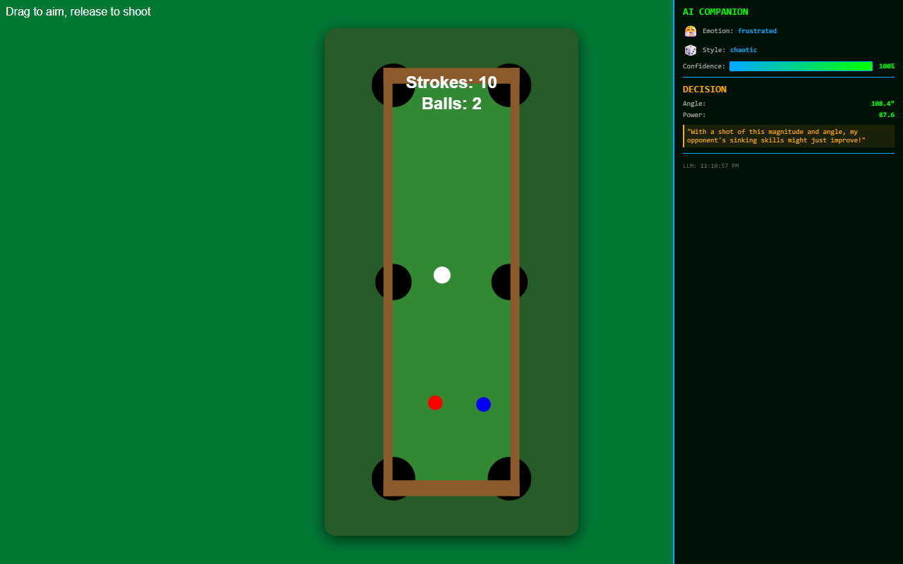

Make your LLM play minigolf / fake billiards and provide play-by-play commentary - feat: 5 distinct player personalities + emotional state, all running locally using phi3 on Ollama (or deployed models in Azure OpenAI/Foundry to burn tokens).



## Prerequisites

- **Node.js 18+** and npm
- **Ollama** (https://ollama.ai) with phi3 model
  ```bash
  ollama pull phi3:latest
  ```
- Ollama running on `http://127.0.0.1:11434` (default)

## Setup

1. **Clone and install:**
   ```bash
   npm install
   cd tester && npm install
   ```

2. **Start Ollama:**
   ```bash
   ollama serve
   # In another terminal:
   ollama pull phi3:latest
   ```

3. **Verify Ollama:**
   ```bash
   curl http://127.0.0.1:11434/api/tags
   ```

## Running

### 1. Start HTTP server

```bash
cd game
npx http-server -p 3000 --cors
```

Game available at: http://localhost:3000/index.html?course=zigzag

### 2. Run the AI playtester

In a new terminal:
```bash
cd tester
node ai_playtester.js [course] [personality] [mode]
```

**Arguments:**
- `course` - `zigzag`, `s-curve`, `l-shape`, `billiards` (default: `zigzag`)
- `personality` - `aggressive`, `chaotic`, `cautious`, `perfectionist`, `strategic` (default: `strategic`)
- `mode` - `auto` or `interactive` (default: `auto`)

**Examples:**
```bash
node ai_playtester.js zigzag aggressive    # Aggressive minigolf
node ai_playtester.js billiards chaotic    # Chaotic billiards
node ai_playtester.js s-curve cautious     # Safe minigolf
```